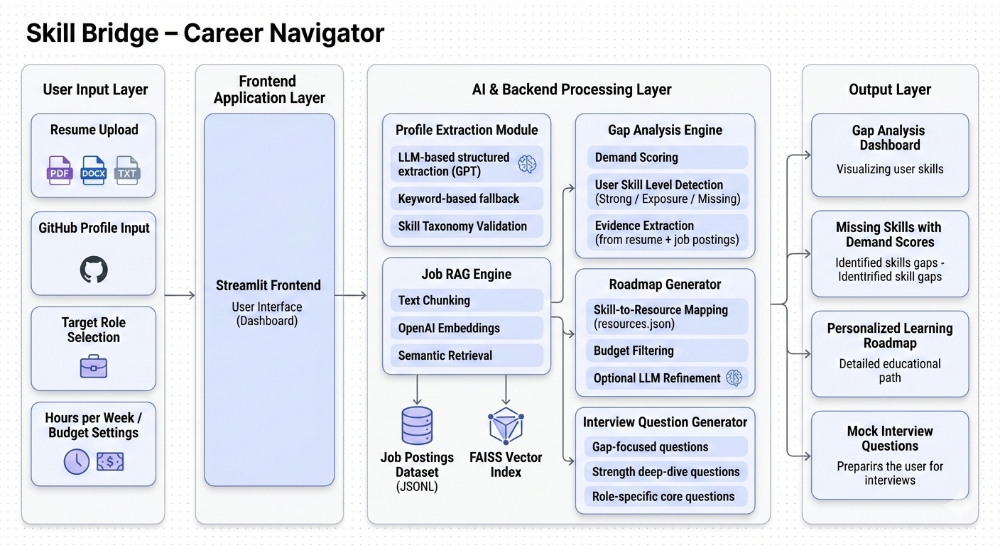
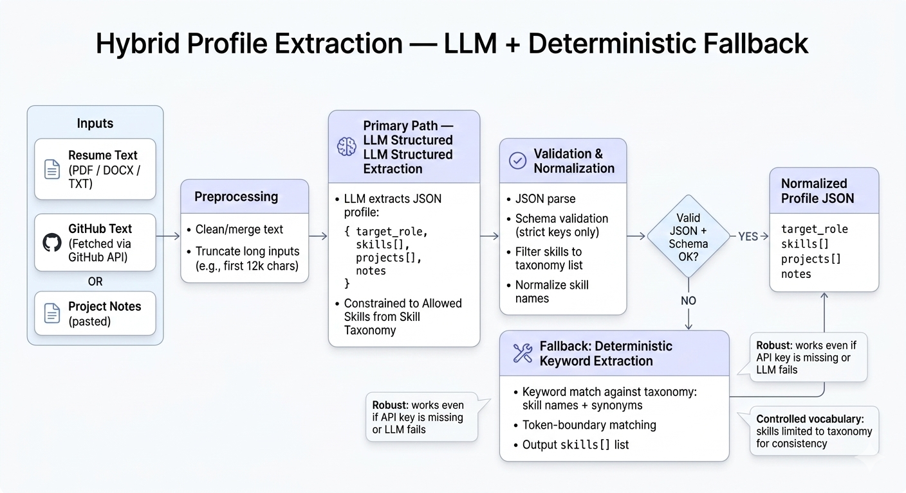
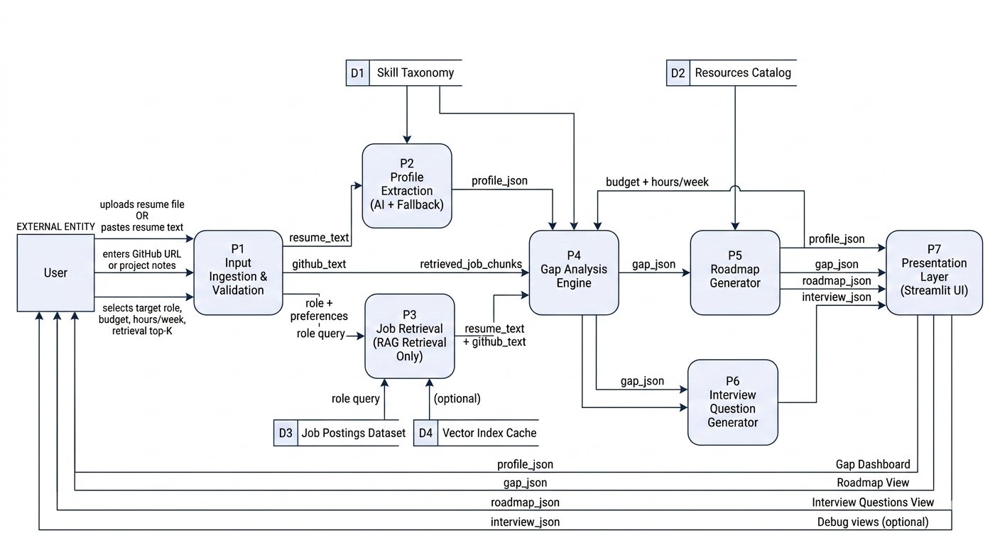

# Skill Bridge – Evidence-Driven Career Navigator

## Author
Karthik

---

## Overview

Skill Bridge is a modular career intelligence system that analyzes synthetic resume and GitHub-style input, retrieves relevant job requirements from a structured dataset, computes demand-weighted skill gaps, and generates an actionable learning roadmap.

The system prioritizes:
- Deterministic and explainable decision logic
- AI integration with reliable fallback
- Clear module boundaries
- Privacy-safe synthetic datasets

---

## System Architecture



The system is structured into three layers:

**Input Layer**
- Resume parsing (PDF, DOCX, TXT)
- Optional GitHub metadata ingestion
- Role selection and user constraints

**Intelligence Layer**
- Hybrid profile extraction
- Job requirement retrieval (semantic search)
- Demand-weighted gap analysis
- Roadmap generation
- Interview generation

**Output Layer**
- Gap dashboard
- Learning roadmap
- Interview questions

---

## Hybrid Profile Extraction



Profile extraction uses a dual-path strategy:

**Primary Path**
- LLM structured JSON extraction
- Strict schema validation
- Skill filtering via taxonomy

**Fallback Path**
- Deterministic keyword extraction
- Token-boundary regex matching
- No API dependency

This ensures resilience and reproducibility.

---

## RAG Pipeline


Job retrieval is implemented using a local semantic retrieval pipeline:

1. Synthetic job dataset (JSONL)
2. Text chunking
3. Embedding generation
4. FAISS vector indexing
5. Top-K similarity retrieval

Retrieved chunks are passed to the deterministic gap engine.

---

## Data Flow



The data flow consists of:

1. Input validation and parsing
2. Structured profile extraction
3. Job retrieval
4. Gap scoring
5. Roadmap and interview generation
6. UI rendering

All data stores are local and synthetic.

---

## Gap Analysis Engine

The gap engine computes:

- **Demand score** → frequency in retrieved job chunks
- **User evidence** → frequency in resume/GitHub text
- Classification:
  - Strong
  - Exposure
  - Missing

Only high-demand skills are surfaced. Each missing skill includes evidence snippets from job data for explainability.

---

## AI Usage

AI is used for:
- Structured profile extraction
- Optional roadmap refinement

Critical scoring remains deterministic.

Fallback ensures functionality without AI.

---

## Data Safety

- Synthetic datasets only
- No scraping
- No real personal data
- `.env` for secrets
- No committed API keys

---

## Quick Start

### Setup

```bash
python -m venv venv
source venv/bin/activate
pip install -r requirements.txt
