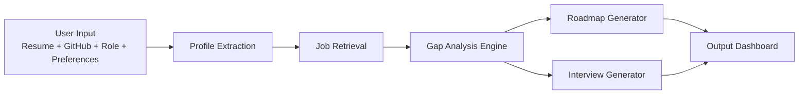
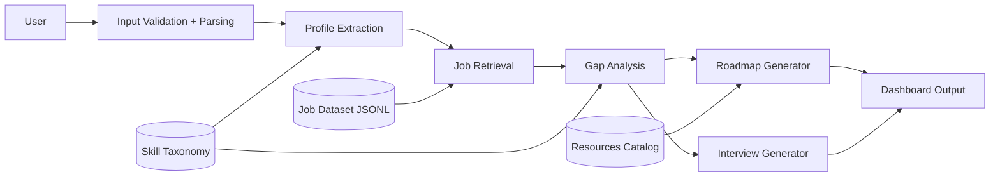
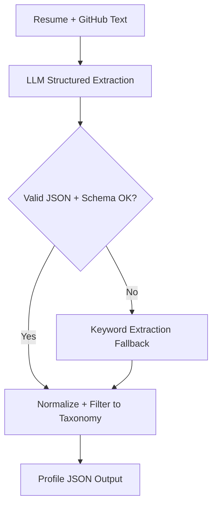
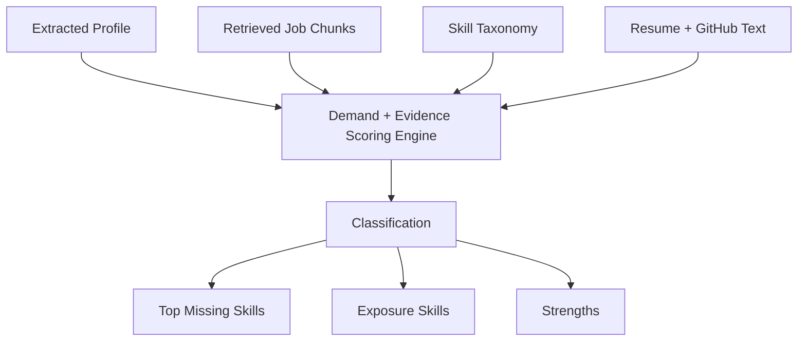

# Skill Bridge – Evidence-Driven Career Navigator  
**Palo Alto Networks – New Grad SWE Take-Home Case Study**

---

## Candidate Name
Karthik Mannem

## Scenario Chosen
Skill-Bridge Career Navigator

## Estimated Time Spent
~5–6 hours

---

# 1. Overview

Skill Bridge is a modular, evidence-driven career intelligence system designed to analyze synthetic resume input, retrieve relevant job requirements, compute demand-weighted skill gaps, and generate an actionable learning roadmap.

The system emphasizes:

- Deterministic decision logic
- Explainable outputs
- AI integration with fallback
- Reliability under degraded conditions
- Clear engineering tradeoffs

The goal was not UI polish, but structured engineering behavior.

---

# 2. System Architecture



### Layers

**Input Layer**
- Resume parsing (PDF/DOCX/TXT)
- GitHub metadata fetch (optional)
- Role + budget + hours configuration

**Intelligence Layer**
- Hybrid extraction (LLM + fallback)
- Semantic job retrieval
- Demand-weighted gap scoring
- Roadmap builder
- Interview generator

**Output Layer**
- Gap dashboard
- Weekly learning plan
- Mock interview questions

---

# 3. End-to-End Data Flow Diagram



All data stores are synthetic and included locally.

---

# 4. Hybrid Profile Extraction Architecture



## Implementation Details

Primary path:
- LLM extracts structured JSON
- Strict schema validation (Pydantic)
- Skills filtered to taxonomy

Fallback path:
- Deterministic keyword matching
- Token-boundary regex
- Works without API key

This ensures reliability even when AI fails.

---

# 5. Gap Analysis Engine (Core Logic)



## Technical Flow

### Step 1 — Demand Scoring
For each skill:
- Count occurrences in retrieved job chunks
- Store evidence snippets
- Ignore low-signal skills (demand < threshold)

### Step 2 — User Evidence Scoring
- Count skill mentions in resume/GitHub
- Classification:
  - Strong (≥2 mentions)
  - Exposure (1 mention)
  - Missing (0 mentions)

### Step 3 — Ranking
- Filter by demand
- Sort descending
- Produce structured JSON output

All outputs are explainable and evidence-backed.

---

# 6. AI Integration + Fallback

AI is used in two places:

1. Structured profile extraction
2. Optional roadmap/interview refinement

Fallback logic ensures:
- System works without API key
- Schema validation prevents malformed responses
- Deterministic scoring remains intact

AI is assistive — not authoritative.

---

# 7. Core Flow (Create → Analyze → View)

1. Upload resume
2. Extract structured profile
3. Retrieve relevant job requirements
4. Compute skill gaps
5. Generate roadmap
6. Generate interview questions
7. Display dashboard

Basic validation and error handling implemented throughout.

---

# 8. Testing

Two basic tests implemented:

## Happy Path
- Valid resume input
- Structured profile extraction
- Gap engine produces expected structure

## Edge Case
- Empty resume input
- Malformed LLM JSON
- Fallback execution verified

Testing focuses on behavior correctness over full coverage.

---

# 9. Data Safety & Security

- Synthetic datasets only
- No live scraping
- No real personal data
- `.env` used for secrets
- `.env.example` provided
- No API keys committed

---

# 10. Tradeoffs & Prioritization

Given the 4–6 hour timebox, I prioritized:

- Clean modular architecture
- Deterministic gap scoring
- AI fallback reliability
- Explainable outputs

Cut for time:
- Production deployment
- Advanced heuristics
- Real-time ingestion
- Extended test coverage

---

# 11. Future Improvements

If extended further:

- Seniority-aware skill weighting
- Real-time job ingestion
- Index refresh pipeline
- Async retrieval
- CI/CD pipeline
- Expanded testing coverage
- User authentication

---

# 12. Quick Start

## Prerequisites
- Python 3.10+
- pip

## Setup

```bash
git clone <repo>
cd skill_bridge_career_navigator
python -m venv venv
source venv/bin/activate
pip install -r requirements.txt
```

Create `.env`:

```
OPENAI_API_KEY=your_key_here
```

## Run

```bash
streamlit run app.py
```

## Run Tests

```bash
pytest
```

---

# 13. AI Disclosure

**Did you use an AI assistant?**  
Yes.

**How did you verify suggestions?**
- Manual code review
- Schema validation enforcement
- Edge case testing
- Rejected overly LLM-dependent scoring logic

**Example of rejected suggestion:**  
Initially considered allowing the LLM to determine skill gaps directly. Rejected in favor of deterministic demand scoring for reproducibility and explainability.

---

# 14. Reflection

This project was approached as a structured engineering exercise under time constraints.

The focus was:

- Reliability over flash
- Explainability over opacity
- Deterministic logic where correctness matters
- AI used thoughtfully with safeguards

Thank you for the opportunity to build and demonstrate this system.
